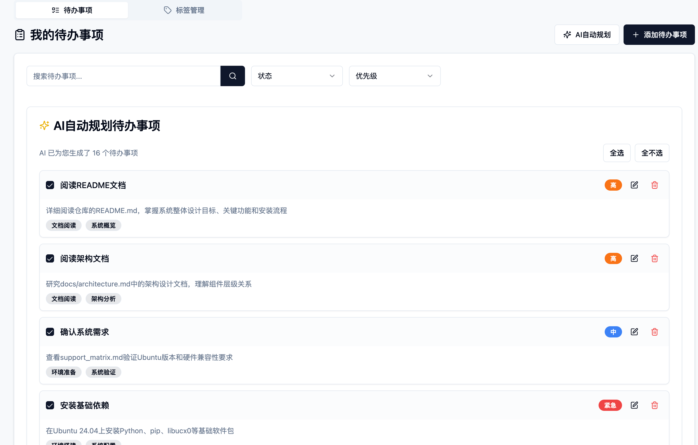

# me : 基于《认知觉醒》的自我管理系统

[](https://github.com/magicsong/me/stargazers)
[](https://book.douban.com/subject/35193035/)

> "真正的成长不在于懂得多少道理，而在于改变多少" —— 周岭《认知觉醒》

## 🌟 项目缘起
在深度实践《认知觉醒》的过程中，我发现：
- 90%的成长困境源于「道理都懂但做不到」
- 「元认知」需要可视化工具才能持续激活
- 本能脑/情绪脑/理智脑的博弈需要数字结界

于是将书中7大核心概念（元认知、拉伸区、心智带宽...）编译成可执行的数字工具，打造认知进化的「行为编译器」

### 一些功能展示
> 个人每日总结AI我觉得最惊艳，如果用最真实的每日总结，效果极好，总能在你意想不到的地方提醒
1. AI智能目标规划
  
## 🚀 快速开始
```bash
# 项目使用方式
git clone https://github.com/magicsong/me.git
cd me && pnpm install
```

## 🌱 共建计划

这个项目目前90%的代码是用AI写的，本人是一个后端工程师，基本没用过前端。是否觉得神奇？！
> 用AI在AI平台上打造我的AI来帮助我

**贡献指南**  
1. Fork本仓库，在develop分支开发
2. 阅读[AI编程指南](./docs/ai_programming_guide.md)
3. ** 如果使用AI提交功能，每次必须attach [RulesForAI.md](./RulesForAI.md) **
4. 提交PR，也可以附上你的AI编程心得
